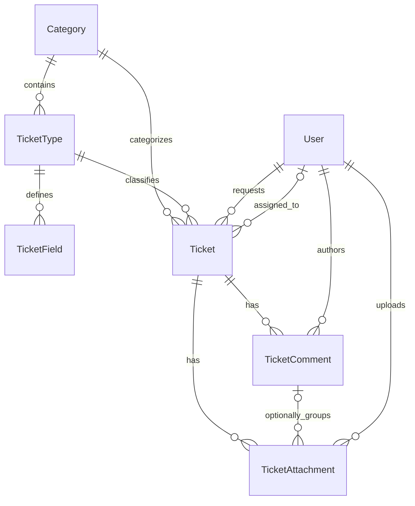
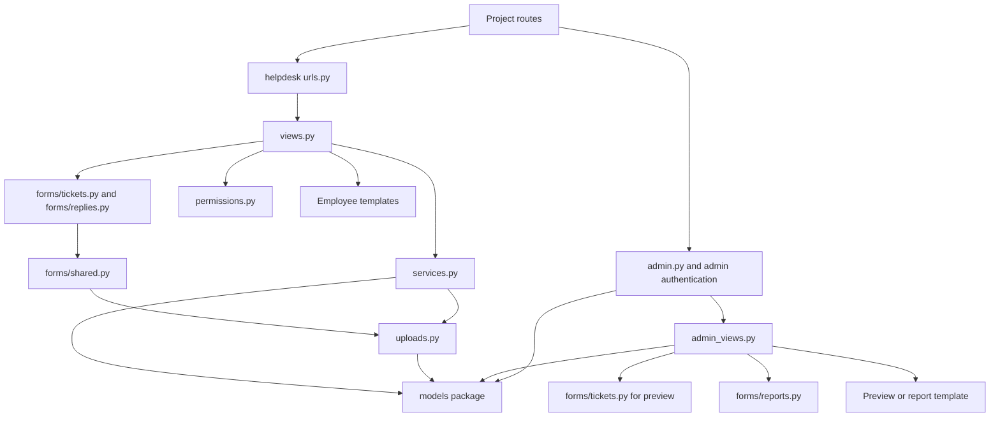

# SCI IT Helpdesk

Server-rendered Django + iommi employee forms and Unfold administration. The existing dependency versions are retained: 
Django 6.1.1, iommi 7.32.2, django-unfold 0.107.0. No new Python or frontend dependencies.

## Code guide

The app has two entry points: employees use the portal, while IT staff use Django admin.
Both use the same models, permissions, and private attachments. Request form definitions
are editable database records; the forms package turns those records into validated inputs.

### Folder map

```text
helpdesk/
├── models/                 Database records and their rules
│   ├── __init__.py         Stable imports and Django model discovery
│   ├── definitions.py      Categories, request types, and configured fields
│   ├── tickets.py          Submitted tickets and status lifecycle
│   └── activity.py         Comments, attachments, and storage destinations
├── forms/                  Input construction and validation
│   ├── __init__.py         Stable imports for existing callers
│   ├── shared.py           Common style, text limits, and attachment controls
│   ├── tickets.py          Dynamic request forms and answer snapshots
│   ├── replies.py          Public reply form
│   └── reports.py          Staff report filters
├── views.py                Employee pages and protected downloads
├── admin_views.py          Staff preview and report pages
├── admin.py                Admin screens, inlines, and custom route registration
├── urls.py                 Employee routes
├── permissions.py          Visibility and eligible assignees
├── services.py             Save ticket activity with rollback cleanup
├── uploads.py              Validate, store, and remove uploaded files
├── tests.py                Regression tests
├── apps.py                 Django application registration
├── __init__.py             Python package marker
├── migrations/             Schema history and starter form data
├── templates/              Employee pages, shared fragments, login, and reports
├── static/helpdesk/        Stylesheets, admin theme script, fonts, and logo
└── README.md               This guide and operating instructions
```

### Python and database files

| File | Purpose and connections |
| --- | --- |
| [urls.py](urls.py) | Maps the five employee routes to portal views: list, choose, create, detail, and attachment. |
| [views.py](views.py) | Handles employee requests, binds ticket/reply forms, applies visibility rules, calls the save service, and streams authorized downloads. Its `dispatch_form()` rejects malformed action markers. |
| [admin.py](admin.py) | Registers category, ticket type, ticket, user, and group screens. Defines field/comment/attachment inlines, assignment choices, and the admin-only comment form. Registers preview/report URLs through `admin_site.admin_view`. |
| [admin_views.py](admin_views.py) | Serves saved-form preview and filtered reports. Reuses ticket-form construction for preview and report filters for reporting; applies each page's permission checks. |
| [models/__init__.py](models/__init__.py) | Imports all six models for Django discovery and exposes the original import names. Also exposes `private_storage` and `attachment_path`, which the original migration references. |
| [models/definitions.py](models/definitions.py) | `Category` groups requests; `TicketType` defines a request form; `TicketField` describes each custom input, its ordering, choices, and validation rules. |
| [models/tickets.py](models/tickets.py) | `Ticket` stores the request, status, priority, assignment, answer snapshots, and timestamps. Its save method captures original labels and maintains resolution/closure dates. |
| [models/activity.py](models/activity.py) | `TicketComment` stores public replies/internal notes. `TicketAttachment` records a private file and optional comment link. Storage helpers choose the private root and generated filename. |
| [forms/__init__.py](forms/__init__.py) | Re-exports existing form functions and constants so imports such as `from helpdesk.forms import ticket_form` continue to work. |
| [forms/shared.py](forms/shared.py) | Shared iommi style, text-length validation, attachment input construction, and attachment validation feedback. Calls the file checks in `uploads.py`. |
| [forms/tickets.py](forms/tickets.py) | Builds core and configured fields from an allowlist of iommi factories, validates custom answers, fingerprints definitions to reject stale submissions, and creates historical answer snapshots. |
| [forms/replies.py](forms/replies.py) | Builds the public reply form. Requires text, attachments, or both, and reuses the shared field/style helpers. |
| [forms/reports.py](forms/reports.py) | `ReportFilters` validates creation dates, category, and status, including rejection of reversed date ranges. |
| [permissions.py](permissions.py) | Determines who can view tickets across requesters, restricts ordinary users to their own tickets, and selects active staff eligible for assignment. Endpoint-specific checks also live in the views/admin. |
| [services.py](services.py) | Saves a ticket or reply and its attachments in a database transaction. Replies update activity without overwriting concurrent staff changes. Failed saves trigger file cleanup. |
| [uploads.py](uploads.py) | Checks file counts, sizes, extensions, and basic contents; saves attachment records/files and cleans up failed writes. It does not serve downloads. |
| [tests.py](tests.py) | Exercises submissions, validation, snapshots, permissions, uploads, admin workflows, reporting, and compatibility of package exports and migration callbacks. |
| [apps.py](apps.py) | Declares `HelpdeskConfig`, enabled by project settings. |
| [__init__.py](__init__.py) | Empty marker making helpdesk a Python package. |
| [migrations/__init__.py](migrations/__init__.py) | Marks the database migration package. |
| [migrations/0001_initial.py](migrations/0001_initial.py) | Creates the six model tables, relationships, constraints, and reporting permission. Keeps its original storage callback imports. |
| [migrations/0002_starter_forms.py](migrations/0002_starter_forms.py) | Seeds the Hardware, Software, and Access request definitions. This is historical setup data; edit current definitions through admin. |
| [README.md](README.md) | Explains the code structure, local setup, permissions, workflows, limits, and verification commands. |

The package initializers preserve the public imports; callers do not need to know the internal file layout.
Within each package, modules import shared helpers directly from their sibling modules.
Model relationships crossing files use Django model-name strings. The package split changes neither
table names nor stored data, and does not require a migration.

### Templates and assets

| File | Purpose / used by |
| --- | --- |
| [templates/helpdesk/base.html](templates/helpdesk/base.html) | Shared employee layout, navigation, messages, stylesheet, and footer; also used by login and staff preview. |
| [templates/helpdesk/index.html](templates/helpdesk/index.html) | My tickets list, search, status filter, and pagination. |
| [templates/helpdesk/choose.html](templates/helpdesk/choose.html) | Active categories and request types available for a new ticket. |
| [templates/helpdesk/create.html](templates/helpdesk/create.html) | New-ticket form and saved-form preview, selected by the `preview` context flag. |
| [templates/helpdesk/detail.html](templates/helpdesk/detail.html) | Ticket information, original answers, public conversation, attachments, and reply form. |
| [templates/helpdesk/iommi_form.html](templates/helpdesk/iommi_form.html) | Shared iommi form wrapper: CSRF token, errors, field layout, submit/cancel actions. |
| [templates/helpdesk/field.html](templates/helpdesk/field.html) | Individual input, label, required indicator, help text, and validation errors. |
| [templates/helpdesk/answers.html](templates/helpdesk/answers.html) | Read-only answer snapshots, reused in ticket detail and the admin ticket screen. |
| [templates/helpdesk/attachments.html](templates/helpdesk/attachments.html) | Download links and sizes for ticket-level and reply-level attachments. |
| [templates/helpdesk/pagination.html](templates/helpdesk/pagination.html) | Shared pagination for employee ticket lists and staff reports; retains active query parameters. |
| [templates/registration/login.html](templates/registration/login.html) | Employee login screen rendered by Django's login view in the project account routes. |
| [templates/admin/helpdesk/reports.html](templates/admin/helpdesk/reports.html) | Admin report filters, counters, breakdowns, and matching-ticket list. Extends the admin layout. |
| [static/helpdesk/helpdesk.css](static/helpdesk/helpdesk.css) | Employee portal styling, layout, forms, accessibility focus states, and responsive rules. |
| [static/helpdesk/admin.css](static/helpdesk/admin.css) | Admin font/logo adjustments, answer display, and report-page styling. |
| [static/helpdesk/admin-theme.js](static/helpdesk/admin-theme.js) | Resets Unfold's remembered theme to the configured light theme. |
| [static/helpdesk/sci-logo.svg](static/helpdesk/sci-logo.svg) | SCI logo used by the portal and admin branding. |
| [static/helpdesk/Lato-Regular.ttf](static/helpdesk/Lato-Regular.ttf) | Locally served regular-weight font for both stylesheets. |
| [static/helpdesk/Lato-Bold.ttf](static/helpdesk/Lato-Bold.ttf) | Locally served bold font for both stylesheets. |
| [static/helpdesk/Lato-Black.ttf](static/helpdesk/Lato-Black.ttf) | Locally served heavy font for headings. |
| [static/helpdesk/Lato-OFL.txt](static/helpdesk/Lato-OFL.txt) | License shipped with the Lato fonts. |

`__pycache__/` folders and `.pyc` files are generated Python caches, not source modules to maintain.
Private user uploads live outside `static/` and are served only through the authorized download view.

### How the records connect



`User` means the configured `AUTH_USER_MODEL`. A ticket retains its category and request-type
relationships, but also stores original labels and custom answers as snapshots. Editing a form's
fields later does not rewrite those submitted answers. An attachment always belongs to a ticket
and may additionally belong to one of its comments.

### Request flow and module dependencies



1. **Submit a ticket:** the employee chooses an active request type. The ticket form loads its configured
   fields, checks inputs/files and the definition fingerprint, then the view snapshots answers and calls
   `save_ticket_activity()`. The service saves the ticket and files together; the employee is redirected to detail.
2. **Reply or download:** detail checks ticket visibility and reply permissions, shows the public conversation,
   and uses the reply form and save service. Downloads separately check ownership/staff permissions and internal-note
   access before streaming the private file. Visiting the public conversation as IT still shows only public replies.
3. **Work in admin:** Django admin handles assignment, status, and priority changes. Its comment inline adds public
   replies or internal notes through `save_formset()`. Admin inline saves use Django's admin save flow, rather than
   the portal's service; files are added through the linked public conversation page.
4. **Preview a form:** admin wraps the custom preview route with its authentication check; the view checks model
   access and renders the existing ticket form with submission disabled. It writes no ticket.
5. **View reports:** the admin wrapper and report permissions gate access. Validated filters select one ticket
   queryset for all counts, breakdowns, and pagination. Invalid filters produce errors and no matching tickets.

### Suggested reading order

Start with `urls.py` and `views.py` to see what an employee can do. Follow ticket creation into
`forms/tickets.py`, then `services.py` and `uploads.py`. Read the three model files to understand what
is stored. Open the corresponding templates to connect the code to the pages. Finally read `admin.py`,
`admin_views.py`, and `forms/reports.py` for the staff workflows. Use `tests.py` for concrete examples.

### Where to change what

| Change | Start here |
| --- | --- |
| Add a request type, field, dropdown choice, or change ordering | Admin Categories / Ticket types / inline Ticket fields; these are data changes. |
| Add a new supported input kind | `models/definitions.py` choices, `forms/tickets.py` factory/validation, answer rendering as needed, and tests; review migration output. |
| Change core ticket inputs or stale-form handling | `forms/tickets.py`; core persisted fields also belong in `models/tickets.py`. |
| Change reply validation or attachment input hints | `forms/replies.py` or `forms/shared.py`. |
| Change file acceptance rules or save/cleanup behavior | `uploads.py`; count/size/root settings live in project settings. |
| Change ticket visibility, reply rights, or download access | `permissions.py` and the relevant checks in `views.py`; test employee and staff cases. |
| Change status lifecycle or timestamps | `models/tickets.py`. |
| Change admin editing, inlines, or eligible assignees | `admin.py` and `permissions.py`. |
| Change reporting filters, calculations, or layout | `forms/reports.py`, `admin_views.py`, and the admin report template respectively. |
| Change employee presentation | Corresponding employee template and `static/helpdesk/helpdesk.css`. |
| Change navigation, login routes, branding, or upload limits | Project settings/routes below; portal navigation also lives in its base template. |

### Connections outside this app

| Location | Connection |
| --- | --- |
| [Project settings](../core/settings.py) | Enables helpdesk, Django auth, iommi, and Unfold; configures database, timezone, login redirects, private upload limits/root, and admin branding/navigation. |
| [Project routes](../core/urls.py) | Mounts `/helpdesk/` and `/admin/`, defines login/logout routes, and redirects the site root to My tickets. |
| [PyCharm launcher](../run_helpdesk.py) | Runs the development server with no arguments; edit its `HOST` and `PORT` constants. |
| [Management entry point](../manage.py) | Runs Django management commands, migrations, and tests. |
| [Dependencies](../../requirements.txt) | Existing Django, iommi, and django-unfold dependencies. |
| `intranet/private_uploads/` | Default private file directory from settings. It is runtime data, not a static asset folder or public route. |
| `intranet/core/asgi.py` and `intranet/core/wsgi.py` | Standard deployment entry points for the project. |

Microsoft Entra SSO is a future authentication integration, not an enabled feature. The existing
account routes and authentication settings are its integration point; see the SSO section below.

## Run locally

The initial migrations have been applied to the workspace SQLite database.
It contains the three starter request forms, **no users and no tickets**.

Select `C:\Programing Projects\djangoIntranet\.venv\Scripts\python.exe` in PyCharm and run `intranet/run_helpdesk.py` 
with no arguments. The host and port are editable constants at the top. Open:

- Employee portal: <http://127.0.0.1:8000/helpdesk/>
- Administration: <http://127.0.0.1:8000/admin/>
- Reports: <http://127.0.0.1:8000/admin/helpdesk/ticket/reports/>

Create the first administrator interactively in PyCharm's terminal; no default password is installed:

Open **View → Tool Windows → Terminal** (Alt+F12), using PowerShell. The ordinary Run console can lack the interactive TTY Django needs, causing account creation to be skipped. Run the command below from the repository root, then enter your username, email, and password at the prompts. Password entry does not echo characters.

```powershell
& '.\.venv\Scripts\python.exe' intranet/manage.py createsuperuser
```

For a fresh checkout, apply migrations first:

```powershell
& '.\.venv\Scripts\python.exe' intranet/manage.py migrate
```

This is the existing project's local-development configuration. Before deployment, configure a private production
SECRET_KEY, DEBUG=False, allowed hosts, HTTPS/session security, static serving, and private upload backups. 
Do not publish the development server. Keep the private upload folder outside every public web-server/static/media
mapping, and configure the reverse proxy's request limit to accommodate at most five 10 MB files plus multipart overhead.
File checks are basic type validation, not malware scanning.

## Accounts and permissions

Use Django admin Users and Groups. Employees need an active account; 
they do not need `is_staff` or helpdesk model permissions. They can submit requests and view/reply/download only 
within their own tickets.

Create an **IT agents** group with these helpdesk permissions, and give its members Staff status:

- Ticket: **view**, **change**.
- Ticket comment: **view**, **add**. Existing comments are read-only.
- Ticket attachment: **view**, **add**. Add public files through the ticket's **Open public conversation / attach files** link.
- **Can view helpdesk reports**, when reports are needed.

Form administrators additionally need **view/add/change/delete** for Category, Ticket type, and Ticket field. 
Give account-management permissions only to people who should manage users and privilege assignments. Superusers already have all permissions. Staff status alone grants no ticket access; no group memberships are assigned automatically.

Unfold is kept in the approved light theme, including browsers that previously remembered auto/dark. Logout is POST-only.
Accounts/passwords are managed by administrators; password-reset email delivery is outside this MVP.

## Create and change request forms

1. Under **Categories**, create a category with its name, description, position, and Active flag.
2. Under **Ticket types**, add a type in that category and save it.
3. Add **Ticket fields** inline: label, field type, required, help text, choices, position, and Active.
4. Enter dropdown/multiple-choice options one per line. Options must be unique; there may be 1–100 options of up to 200 characters. A required checkbox must be checked.
5. Save, then select **Preview saved form**. Preview does not submit tickets and also works for inactive definitions.
6. Activate the category/type when ready. Employees choose a request under **New ticket**.

Core fields (subject, description, priority, attachments) are shared by all forms. Dynamic fields support short/long text, 
email, integer, decimal, date, checkbox, dropdown, and multiple choice. Position orders fields; ties use creation order. 
Required dropdowns begin with an empty prompt rather than silently selecting the first answer. There are no conditional
rules or arbitrary executable validators.

Starter forms: Hardware → Computer problem, Software → Software issue, Access → Access request. The generic
On-site/Remote/Other location choices are editable. Access requests only create tickets; they do not provision permissions.

Edits apply to new submissions. Existing tickets retain original category/type labels and a snapshot of each submitted 
custom field's label, type, choices, and answer. Ticket answers are read-only in both interfaces. If a form changes 
while someone is filling it in, submission is rejected with an explanation; review the updated fields and re-select
attachments before retrying. Deactivate used categories/types instead of deleting them. Ticket history and related user 
records are protected from cascading deletion.

## Work tickets

The IT ticket list supports search, category/type/status/priority/assignee filters, and date navigation. On a ticket,
set status, priority, and assignee; add a conversation inline with Internal unchecked for an employee-visible reply or
checked for a staff-only note. Only active staff with ticket-change permissions appear as assignees. Existing conversation 
entries cannot be edited or deleted in this interface.

Employees see current status, original answers, attachments, and public replies. They can reply with text, files, or both.
Replies update the activity timestamp without overwriting concurrent status or assignment changes. Replies never reopen or
otherwise change status automatically. Admin status changes are recorded in Django's history. Resolved/closed timestamps 
reflect the current resolution cycle and clear when reopened.

Uploads accept PNG, JPG/JPEG, PDF, UTF-8 TXT, DOCX, and XLSX, up to five files per submission/reply and 10 MB per 
nonempty file. Macro-enabled Office containers are rejected. Files use generated names under `intranet/private_uploads/`; 
original display names are retained separately. Downloads require authorization and use attachment disposition, 
octet-stream content type, no-store, and nosniff. There is no public media route. Failed saves remove newly written files, 
including interrupted partial writes. Back up SQLite and the private file directory together.

## Reports

The dedicated report permission and ticket-view permission are both required. Filters use **ticket creation date**, 
inclusive in America/New_York, plus category and status. Every counter, breakdown, and table uses the same filtered tickets:

- Total tickets: all matching tickets.
- Open tickets: New, In progress, or Waiting.
- Unassigned open: matching open tickets with no assignee.
- Resolved or closed: matching tickets in either terminal status.

Breakdowns group by category and current status. The matching-ticket list has 25 rows per page. 
Invalid filters display errors and no results. This foundation has no SLA, trend, historical-status, or time-to-resolution 
claims. Renamed categories use current names in report groupings; individual tickets retain submission labels.

## Microsoft Entra SSO seam

Django accounts are the sole enabled identity provider. Ticket relationships use `settings.AUTH_USER_MODEL`, 
user lookups use `get_user_model()`, and application access is tied to authenticated users and Django permissions rather
than an email domain or provider.

For the future integration: choose a supported Entra/OIDC Django authentication package, register the application and 
callback URI in the intended tenant, configure issuer/client/secret outside source control, and add the provider at the
centralized account routes/authentication backend settings. Validate tenant, issuer, audience, nonce, and state with the 
provider library. Map a verified stable identity (issuer/subject or tenant/object ID) to an existing local user through
an explicit verified linking process; never auto-link by a matching email address alone. Define provisioning, 
deprovisioning, group-to-permission mapping, and break-glass local-admin policies before enabling SSO. No dormant 
callbacks, secrets, provider package, or Microsoft button are included.

## Verification

Package reorganization validated: 21 Django tests pass, including the original 19 plus package/migration compatibility
and admin access/method checks; Django checks are clean; no missing migrations. A fresh file-backed SQLite database
migrates successfully and contains only three starter categories/types, with zero users, tickets, or attachments.

The original MVP browser checks covered configuration and preview, employee submission with a file, IT assignment/status/public
reply/internal note, employee tracking and text-only reply, and populated/empty reports. Desktop (1536�1024) and mobile (390�844) layouts were inspected; native required validation, visible keyboard focus, associated labels, and server error messages were checked. No browser console warnings/errors were captured. Browser testing used an isolated disposable database, never the workspace data.

The package reorganization was checked with automated tests; the browser checks above were not repeated for this refactor.

Run from the repository root:

```powershell
& '.\.venv\Scripts\python.exe' intranet/manage.py test helpdesk
& '.\.venv\Scripts\python.exe' intranet/manage.py check
& '.\.venv\Scripts\python.exe' intranet/manage.py makemigrations --check --dry-run
```

Tests use a separate database and patch the model's actual file storage to a temporary directory. They cover field parsing, 
required inputs, forged values, stale definitions, historical snapshots, ownership, internal notes, staff permissions,
CSRF/logout, valid and invalid files, partial writes, rollback cleanup, admin changes, concurrent replies, and 
report filters/counts/local dates.

Brand assets: SCI's public SVG from `https://standardcal.com/cdn/shop/files/SCI-favicon.svg` (viewBox tightened around 
the existing artwork; paths unchanged). Lato Regular/Bold/Black from Google Fonts, bundled locally under the included 
SIL Open Font License. The mockup's approximate SCI mark is deliberately replaced by the official artwork, and native 
Unfold controls remain in administration.

Deferred: Microsoft SSO activation, conditional forms, automated approvals, email notifications, SLAs, advanced reporting, 
and production hosting.
